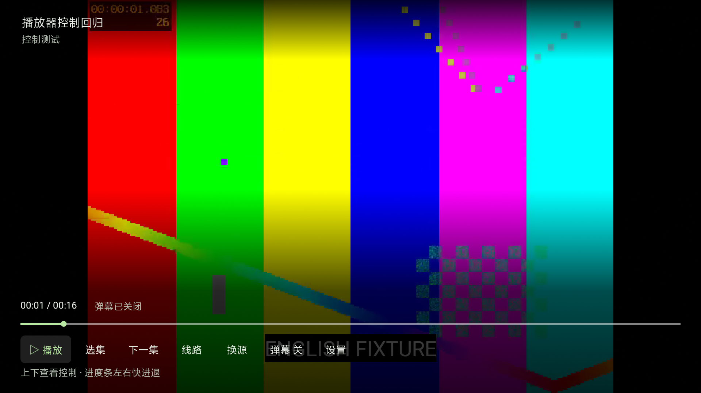
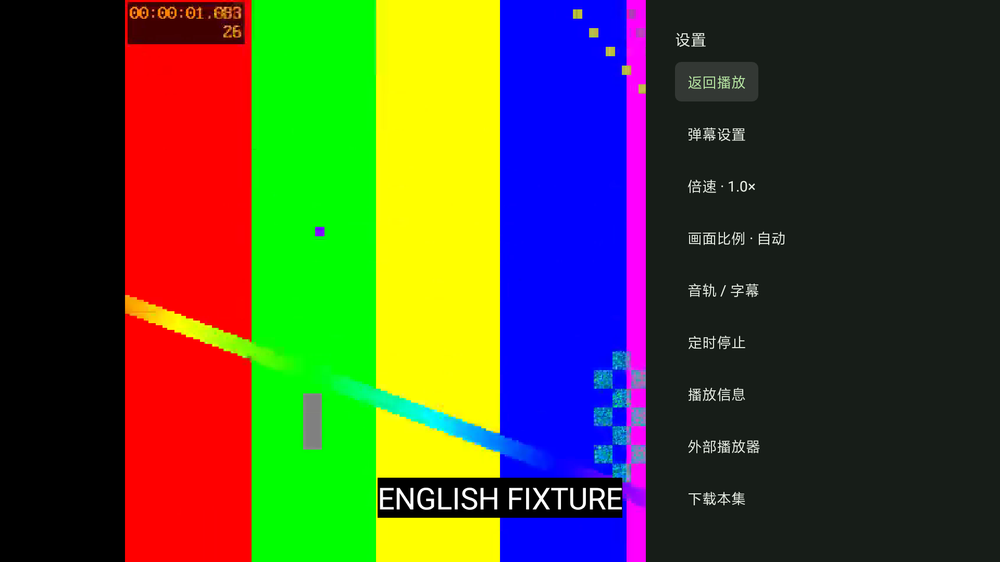

# KazumiTV

为电视遥控器设计的动画浏览与播放应用。当前主线使用 **Kotlin · Compose for TV · Media3**，延续深色、绿色和高密度海报浏览，独立于原 Flutter 工程开发。

**当前正式版：0.3.3。** 本版整合原生播放恢复与电视首页，并修复分类导航崩溃。适用 TV 的完整功能迁移仍在继续；不是上游官方 TV 版。

[下载原生正式版](https://github.com/znbsf/KazumiTV/releases/tag/v0.3.3) · [旧Flutter TV版](https://github.com/znbsf/KazumiTV/releases/tag/v2.3.1-tv-legacy.1) · [功能与验证台账](docs/MIGRATION-STATUS.md) · [下一步](docs/ROADMAP.md) · [本版验收](docs/RELEASE-ACCEPTANCE-20260927.md)

本版（**0.3.3，code53**）：整合同集换线/换源、选集、历史续播与最近观看路径，更新单行导航和六列电视首页。发布前发现并修复“热门”离屏后从收藏向右导致的崩溃；最终 APK 经独立模拟器复测、短时真实播放及数据恢复核对，229 项单测和 Lint 通过。Android 9 电视证据来自此前集成候选，最新焦点修复在 Android 16 模拟器验证。详见[发行说明](docs/RELEASE-0.3.3-STABLE.md)、[验收与版本边界](docs/RELEASE-ACCEPTANCE-20260927.md)、[逐源矩阵](docs/PLAYBACK-P1-MATRIX-20260924.md)和[声画录制方法](docs/AV-ACCEPTANCE-20260927.md)。

## 界面

以下为此前版本的小米 Android 9 电视 1920×1080 实机截图；0.3.3 首页已改为单行导航与最近观看入口。目录封面属于在线节目资料，不是本项目的品牌素材；播放器截图使用自制测试视频，不代表截图中的节目资源可播放。






## 已实现

| 范围 | 当前能力 |
| --- | --- |
| 浏览与资料 | 分类海报、自动加载后续内容、分页搜索、星期/季度排期、详情、全文简介、关联动画、角色与制作名单 |
| 规则与播放源 | 初始化引导、目录镜像、来源安装/导入/更新/排序/恢复、选源与线路、长篇选集分段/倒序/定位、解析取消与分阶段错误 |
| 来源验证 | 图片验证码人工输入后自动提交、规则按钮/脚本自动验证、成功判断、Cookie和原请求恢复、电视网页光标 |
| 内置播放 | Media3、暂停/进度/快进退、选集、换源换线、倍速、画面比例、音轨字幕、系统媒体会话、定时暂停 |
| 弹幕 | 弹弹play只读接入、自动/手动匹配、开关、偏移校准；Preview 5不内置凭证，需在设置填写有效AppId/AppSecret后重新进入播放 |
| 个人数据 | 历史续播与来源上下文、收藏分类/排序/批量管理、隐身播放、删除撤销、本机备份恢复、WebDAV收藏同步预览与条件提交 |
| 下载 | 持久任务、暂停/条件续传、地址重解析、删除、普通MP4/已结束HLS/静态DASH离线播放、清单错误说明 |
| 电视与设备 | 方向键导航、低内存策略、输出兼容、解码信息、显示模式试用/回退、HDR及音频输出能力页 |

“已实现”不等于所有路径和设备均已验收。本版 229 项单元测试通过；系统回收恢复、选集续播、弹幕、过期地址重解析和系统换集等证据按各自构建记录。真实站点、受控测试和未验证项分别列在台账中。

## 安装与使用

- Android 7.0/API24及以上的Android TV设备。原生APK不依赖Flutter或额外libmpv，提供一个通用包；目前主要真机证据来自Android 9、32位ARM小米电视。
- 启动器中选择 **KazumiTV 原生**；旧Flutter归档版显示 **KazumiTV Legacy**。普通Launcher与电视Launcher均指向同一原生应用。
- 下载Release中的APK侧载。原生包名 `com.znbsf.kazumi.compose.tv`；本次Legacy版为 `com.predidit.kazumi.tv`，两者可以并存，数据不自动迁移。
- 首次打开按引导准备播放来源，在设置选择可用镜像，然后从作品详情搜索来源。目录能展示节目不代表对应播放站点可用。
- 遥控器方向键移动，确认选择；播放进度条支持左右调整，返回关闭面板或返回上页。
- 本版延续已有开发签名，Release 构建不可调试；证书与公开 Preview6 相同，覆盖升级保数据已验证。长期签名管理方案仍需完善，升级前建议备份收藏/历史。

## 已知限制

- 不是所有来源都能成功搜索/解析；网站变动、失效地址、验证码和旧WebView兼容仍是重点。当前17源的成功、失败和需验证项均见逐源表；不承诺所有线路可用。跨来源进度对齐只在集数唯一匹配时成立。
- Sorani旧测试包保留完整单集与自然下一集记录；本轮按要求不做整集测试。Android 9既有历史入口的系统杀进程恢复专项通过，其他页面/设备、待机和网络切换仍需分别验收。
- 弹幕长时同步及跨版本剧集映射仍需验证。不会发送弹幕或评论；在线服务可能限流或失效。
- 下载暂不支持直播/DRM授权、轨道筛选、外部字幕/弹幕缓存；存储异常和新Android后台限制仍需补验。
- WebDAV收藏同步只完成受控服务测试，真实多设备冲突、历史同步和Bangumi账号同步尚未完成。
- 外播可以选择/唤起应用并返回暂停；本机MX Player自动返回，尚未确认实际外播画面及进度回传。不要将外播作为内置播放的可靠替代。
- Anime4K/超分、自动帧率匹配、实际HDR/音频直通优化、Syncplay、PiP、投放、截图及部分资料/规则诊断功能仍未完成。

## 两条路线

| | 原生主线 | Flutter TV旧路线 |
| --- | --- | --- |
| 定位 | 后续主要开发方向 | 保留比较和回退参考 |
| 技术 | Kotlin / Compose / Media3 | Flutter / media-kit |
| 版本 | 0.3.3 | 2.3.1-tv-legacy.1 |
| 源码 | `main` | `codex/upstream-tv-complete` |
| 安装 | 通用APK：约10.34 MiB | armeabi-v7a：29.26 MiB；arm64-v8a：30.23 MiB |

更早的A线Preview 5使用 `com.znbsf.kazumi.tv`，保留在历史Releases；本次Legacy发布来自较新的Flutter完整适配分支，不冒充该A线的覆盖升级。

旧路线沿用较多原应用功能与 TV 适配，新路线的迁移仍未达到完整功能等价。原生 0.3.3 为正式发布，旧 Flutter 版仍为 Pre-release；旧发布和源码分支保留。

<details>
<summary>旧Flutter路线界面对照</summary>


</details>

## 构建

需要JDK17或Android Studio JBR、Android SDK36。不需要Flutter SDK。

```sh
./gradlew :app:assembleRelease :app:testDebugUnitTest :app:lintRelease
```

输出：`app/build/outputs/apk/release/app-release.apk`。不配置凭证也能编译，用户可在设置中自行填写。

维护者可设置环境变量 `KAZUMITV_DANMAKU_FILE` 指向仓库外的Java properties文件，键为 `DANDANAPI_APPID`、`DANDANAPI_KEY`。凭证仅在本机构建时注入，不提交源代码。**APK内置凭证仍可被提取，不能视为安全保密存储。** 详情见[弹幕接入](docs/DANMAKU.md)。

## 来源与许可

基于[Predidit/Kazumi](https://github.com/Predidit/Kazumi)的功能、规则生态和迁移工作，按[GPL-3.0](LICENSE)提供源码。本仓库的独立应用图标与启动横幅没有使用上游人物图标。系统字体随设备提供。

节目资料来自相应在线服务，弹幕由[弹弹play开放弹幕网络](https://www.dandanplay.com/)提供；这些服务及媒体内容的权利归各自权利人。本项目不托管影视资源。第三方组件见[依赖与署名](THIRD_PARTY_NOTICES.md)。
