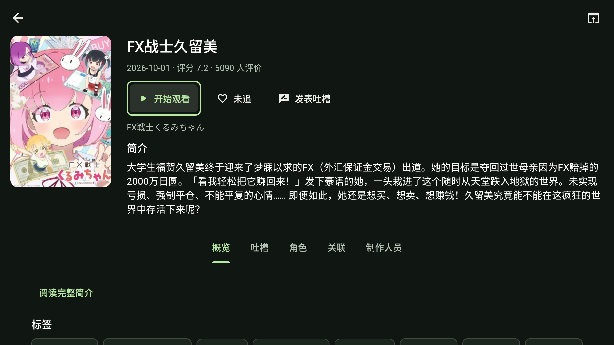

# KazumiTV

为 Android TV 和遥控器设计的动画浏览与播放应用。
基于 **[Predidit/Kazumi](https://github.com/Predidit/Kazumi)**：延续上游的 Flutter/Dart 业务、规则与 media-kit 播放能力，结合本仓库原生 TV 版本的布局和交互工作，形成当前 Flutter TV 融合版。**本项目是独立衍生项目，不是上游官方 TV 版本。**

[下载 0.4.1 正式版](https://github.com/znbsf/KazumiTV/releases/tag/v0.4.1) · [版本记录](CHANGELOG.md) · [构建说明](docs/TV_BUILD_AND_RELEASE.md)

维护入口：[当前项目状态](docs/PROJECT-STATUS.md) · [开发经验](docs/ENGINEERING-LESSONS.md)

## 可以做什么

- **遥控器浏览**：单排横向导航、五列海报卡片、向下持续加载；清晰的焦点高亮，返回时恢复浏览位置。
- **找番与看资料**：分类目录、搜索、排期、作品详情、角色和关联作品。
- **管理播放来源**：导入与管理规则，搜索可用来源，选择线路和剧集。
- **接着看**：收藏、历史记录和分集续播，保留日常追番入口。
- **内置播放**：暂停、进度调整、选集、倍速，以及音轨、字幕和弹幕设置；实际可用能力取决于媒体与来源。

## 界面

以下为当前 Flutter TV 融合界面的实际截图，非历史原生版。节目资料与可播放来源以在线服务的实际返回为准。

**首页 · 横向分类与向下浏览**

**详情 · 作品资料与观看入口**

**播放器 · 遥控器操作与播放进度**

## 下载与安装

当前正式版：**0.4.1**。需要 **Android 7.0/API 24 或更新版本**，按系统 ABI 选择 APK。

0.4.1 正式版基于 `9f5fe263` / 构建号 `20338`：修复弹幕取消/切集状态、恢复合法应用认证注入和历史入口；时间线采用两列三完整行的小海报，首页采用400px清晰图源。小米电视 ARMv7 已实测保留数据升级及播放，用户已确认对白有声、口型同步，暂停和快进后正常。详见 [0.4.1 发布记录](docs/RELEASE-0.4.1.md)。

| 安装包 | 适用系统 |
|---|---|
| [ARMv7](https://github.com/znbsf/KazumiTV/releases/download/v0.4.1/KazumiTV-0.4.1-armeabi-v7a.apk) | 32 位 ARM Android |
| [ARM64](https://github.com/znbsf/KazumiTV/releases/download/v0.4.1/KazumiTV-0.4.1-arm64-v8a.apk) | 64 位 ARM Android |
| [x86_64](https://github.com/znbsf/KazumiTV/releases/download/v0.4.1/KazumiTV-0.4.1-x86_64.apk) | x86_64 Android / 模拟器 |

1. 下载并侧载 APK，在启动器打开 **KazumiTV**。
2. 首次启动按引导准备规则与播放来源，再从作品详情选择来源和剧集。
3. 方向键移动、确认选择、返回关闭面板或回到上页；播放进度可用左右键调整。

包名为 `com.znbsf.kazumi.fluttertv`。从 **0.4.0 起固定使用正式发布证书**；已安装 `0.4.0-preview.1` 的用户需先卸载预览版再安装，预览版数据不会保留。后续正式版沿用同一证书。
它与原生版、Legacy 和实验版并存；不自动迁移这些旧应用的收藏或历史，详见[数据说明](docs/TV_DATA_MIGRATION.md)。应用内自动更新暂未启用，后续版本从本仓库 Release 获取。

## 已知限制

- 来源可能失效、超时或需要验证；目录有作品不保证存在可用播放线路。部分番剧元数据可能遇到连接超时。
- 页面仍可能有长帧，不承诺所有设备60fps。音画确认仅覆盖实测小米电视及所测内容，未进行整集长播或全站点兼容验收。
- 0.4.1正式签名ARMv7包已在小米Android 9电视实测；ARM64/x86_64本轮仅完成构建、签名和产物校验，未作实机验收。

## 来源与许可

感谢 [Predidit/Kazumi](https://github.com/Predidit/Kazumi) 及其贡献者，以及 [media-kit](https://github.com/media-kit/media-kit)、[Bangumi](https://bangumi.tv/) 和[弹弹play](https://www.dandanplay.com/) 等项目与服务。
代码遵循 [GPL-3.0](LICENSE)，保留上游版权和许可；第三方依赖及资源按各自许可使用，详见 [NOTICE](THIRD_PARTY_NOTICES.md)。MiSans 字体版权归 Xiaomi Inc.，遵循其字体协议。节目海报、资料和媒体归各自权利人，本项目不托管影视资源。

[原生 0.3.3](https://github.com/znbsf/KazumiTV/releases/tag/v0.3.3)、[Flutter Legacy](https://github.com/znbsf/KazumiTV/releases/tag/v2.3.1-tv-legacy.1) 与 [0.4.0 预览版](https://github.com/znbsf/KazumiTV/releases/tag/tv-fusion-v0.4.0-preview.1)继续保留；原生[完整源码](https://github.com/znbsf/KazumiTV/tree/24bc50ef47af5e32907ed54413e1eb33c1fb601e)及[历史文档](native-history/README.md)可独立查阅。
